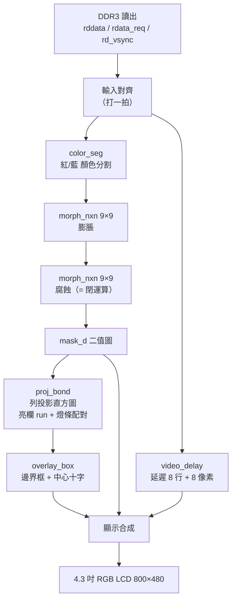

# FPGA4dart

**English** ｜ [简体中文](#简体中文说明) ｜ [繁體中文](#繁體中文說明)

A bold attempt at using FPGA / ZYNQ to enable the **DART robot** in RoboMaster.
This repository currently contains a **pure-Verilog armor-plate vision pipeline** (no neural network):
it segments red/blue light bars, cleans them up with morphology, locates the armor plate by
**column projection**, and draws the bounding box + center cross onto a 4.3" RGB LCD.

Built on top of the ALIENTEK (正點原子) Da Vinci **XC7A35T** example project *39_ov5640_lcd*
(`OV5640 → DDR3 frame buffer → RGB LCD`).

```
OV5640 (RGB565 800×480) → DDR3 ping-pong buffer → [ color seg → morphology → projection → overlay ] → LCD
```

| | |
|---|---|
| **Board** | ALIENTEK Da Vinci XC7A35TFGG484-2 (Artix-7: 20,800 LUT / 41,600 FF / 1,800 Kb BRAM / 90 DSP) |
| **Camera** | OV5640, RGB565, 800×480 |
| **Display** | 4.3" RGB LCD, 800×480, pixel clock 25 MHz (1:1, no scaling) |
| **Tool** | Vivado 2020.2 |
| **Verification** | `xsim` self-checking testbench — 20/20 checks pass (red + blue phase) |
| **Synthesis** | 0 errors / 0 warnings — LUT 3168 (15.2%), FF 805 (1.9%), BRAM 0, DSP 0 |
| **License** | MIT (see [LICENSE](LICENSE)) |

### Repository layout

```
FPGA4dart/
├── rtl/            # Verilog sources (GBK encoded, see "Encoding" below)
├── sim/            # testbench + one-click xsim script
├── prj/            # Vivado project (ov5640_lcd.xpr + ov5640_lcd.srcs)
├── doc/            # design notes, block diagram source, synthesis reports
│   └── vision_pipeline.md      # deep-dive design document (Chinese)
├── tools/          # dev scripts (sim / synth / encoding / path checks)
└── _backup_before_vision/      # stock example files, for rollback
```

### Quick start

```powershell
# 1) RTL simulation (no DDR3 / IP needed, ~1 minute)
cd sim
.\run_vision_sim.bat

# 2) Resource check (out-of-context synthesis of the vision pipeline)
vivado -mode batch -source tools/synth_check_vision.tcl

# 3) On the board
#    open prj/ov5640_lcd.xpr → Generate Output Products → Run Synthesis
#    → Run Implementation → Generate Bitstream → Program device
```

Keys: `key[0]` red/blue mode · `key[1]`/`key[2]` color threshold ±8 · `key[3]` binary view.
LEDs: `led[0]`/`led[1]` red/blue mode · `led[2]` armor detected · `led[3]` heartbeat.

---

## 简体中文说明

> 这是《RM飞镖FPGA视觉方案.md》中 Demo 方案的实现：
> 以官方 **39_ov5640_lcd** 例程为起点，在「DDR3 读出」与「LCD 写入」之间插入一条纯 Verilog 视觉管线。
> 深入设计说明（时序关系、投影法原理、Vivado LUTRAM 推断踩坑）请看 **[doc/vision_pipeline.md](doc/vision_pipeline.md)**。

### 1. 功能

| 功能 | 说明 |
|---|---|
| 颜色分割 | RGB565 → 1bit 二值图，红 / 蓝可用按键切换，阈值可按键 ±8 调整 |
| 形态学去噪 | 9×9 膨胀 → 9×9 腐蚀 = **闭运算**，填补灯条内部小洞、接起断点 |
| 灯条定位 | **列投影法**（不用连通域标记 CCL）：整帧统计每列亮像素数 → 找出最宽的两个亮列区间 |
| 灯条配对 | 宽度相近、间距合理、Y 范围有重叠 → 认定为同一块装甲板 |
| 标记输出 | 绿色边界框 + 中心十字；另可切纯二值图模式方便调阈值 |
| 状态指示 | 4 颗 LED：红/蓝模式、检测到装甲板、心跳 |

### 2. 硬件与环境

| 项目 | 内容 |
|---|---|
| FPGA | 正点原子达芬奇 **XC7A35TFGG484-2**（20,800 LUT / 41,600 FF / 1,800Kb BRAM / 90 DSP） |
| 相机 | OV5640，RGB565，800×480（DVP 接口） |
| 显示 | 4.3 寸 800×480 RGB LCD（`lcd_id` = `0x7084` / `0x4384`，像素时钟 25 MHz） |
| 开发工具 | Vivado 2020.2（仿真器 xsim） |
| 按键引脚 | `key[3:0]` = T1 / U1 / W2 / T3（**低电平有效**） |
| LED 引脚 | `led[3:0]` = R2 / R3 / V2 / Y2（**低电平点亮**） |
| 复位 | `sys_rst_n` = U2 |

### 3. 目录结构

```
FPGA4dart/
├── rtl/                 # Verilog 源代码（GBK 编码）
│   ├── armor_vision.v   #   视觉管线顶层
│   ├── color_seg.v      #   颜色分割（纯组合逻辑）
│   ├── morph_nxn.v      #   N×N 膨胀 / 腐蚀
│   ├── line_buffer.v    #   单行缓冲（LUTRAM 标准模板）
│   ├── video_delay.v    #   像素流延迟（原图对齐）
│   ├── proj_bond.v      #   列投影 + 灯条配对 + 边界框
│   ├── overlay_box.v    #   画框 + 中心十字
│   ├── vision_cfg.v     #   按键 → 模式 / 阈值 / 显示模式
│   ├── key_debounce.v   #   按键同步 + 消抖 + 下降沿
│   └── (官方 39 例程原有的 13 个文件)
├── sim/                 # tb_armor_vision.v + run_vision_sim.bat（一键 xsim）
├── prj/                 # ov5640_lcd.xpr + ov5640_lcd.srcs（IP 的 .xci 都在）
├── doc/                 # vision_pipeline.md、框图 vsdx、综合资源报告
├── tools/               # 开发脚本（见第 12 节）
└── _backup_before_vision/   # 未加入视觉前的原始 39 例程文件（还原用）
```

> 注：`.gen` / `.runs` / `.hw` / `.sim` / `.cache` / `.ip_user_files` 这些**可由源代码重建**的目录没有纳入版本控制（见 `.gitignore`）。
> 第一次打开 Vivado 工程时它会自动重新生成 IP output products。

### 4. 系统架构


**三个关键设计决定**

1. **用投影法取代 CCL**：灯条是「细长垂直亮条」，只要 1D 的每列亮像素统计就够。
   资源只要 800×10bit 的 LUTRAM（约 130 个 LUT），也没有等价类合并、label 回收这些容易出错的逻辑，调试时直方图数值可以直接看。
2. **形态学窗口是「右下角对齐」**：二值图在屏幕上会整体往右下偏移 `N-1 = 8` 像素，
   所以用 `video_delay` 把**原图也延迟 8 行 + 8 像素**，两者在屏幕上完全对齐，框才不会画歪。
3. **框与十字画在同一像素流坐标上**：`proj_bond` 统计出来的坐标就是屏幕坐标，`overlay_box` 直接比对，不需要额外坐标转换。

**时间关系**：直方图在有效显示行累加；帧末（`rd_vsync` 后的垂直消隐）用约 802 个时钟扫描并出框；
Y 上下界是用「上一帧算出的 X 范围」累加的，所以**框会慢一帧**（约 3 帧 ≈ 70ms 后出现），静态靶纸完全无影响。

### 5. 仿真验证

```powershell
cd sim
.\run_vision_sim.bat
# 等同于： xvlog <设计文件...> ; xelab -debug typical tb_armor_vision -s tb_vision ; xsim tb_vision -runall
```

测试台造出与 `lcd_driver`（800×480 面板）**完全相同**的时序，图像为两根红灯光条
（`x=200..219` / `300..319`、`y=120..359`，左灯条中间故意挖 5 行缺口）＋ 一个 4×4 红噪点，并验证 20 项：

| 检查 | 期望 | 说明 |
|---|---|---|
| `bond_l` / `bond_r` | 208 / 327 | 灯条 x 范围 + 形态学偏移 8 |
| `bond_t` / `bond_b` | 128 / 367 | 灯条 y 范围 + 8 |
| `center_x` / `center_y` | 267 / 247 | 边界框中心 |
| `bar_inside` | `0xF908` | 灯条内：命中 → 保持原色（不变暗） |
| `bar_gap` | `0x8410` | **缺口处**：被闭运算填起来（掩膜 = 1）但原图仍是缺口颜色 |
| `bg_dim` | `0x4208` | 框内背景：未命中 → 亮度减半 |
| `box_border` | `0x07E0` | 框线：绿色 |
| 第二阶段 | 同上 + `bar_inside=0x411F` | 换成蓝灯条并按 `key[0]` → 验证消抖、模式切换、蓝色判据 |

实测输出：`==== ALL CHECKS PASSED ====`（红模式 11 项 + 蓝模式 9 项）。

### 6. 按键与 LED

| 按键 | 引脚 | 功能 |
|---|---|---|
| `key[0]` | T1 | 红 / 蓝 模式切换 |
| `key[1]` | U1 | 颜色阈值 +8（上限 255） |
| `key[2]` | W2 | 颜色阈值 −8（下限 0） |
| `key[3]` | T3 | 显示模式切换（0 = 原图变暗+标记；1 = 纯二值图） |

| LED | 引脚 | 含义 |
|---|---|---|
| `led[0]` | R2 | 红色模式 |
| `led[1]` | R3 | 蓝色模式 |
| `led[2]` | V2 | 检测到装甲板（`bond_valid`） |
| `led[3]` | Y2 | 心跳（约 1.5 Hz，证明逻辑在跑） |

### 7. 颜色判据与可调参数

RGB565 先展成 8bit：`r8={R5,R5[4:2]}`、`g8={G6,G6[5:4]}`、`b8={B5,B5[4:2]}`

| 判据 | 条件 |
|---|---|
| 红 | `(r8-g8 > T) && (r8-b8 > T)` |
| 蓝 | `(b8-g8 > T) && (b8-r8 > T)` |
| 亮度门限 | `r8+g8+b8 >= LUM_MIN_SUM`（默认 150，滤掉暗部红色噪声） |

参数都在 `armor_vision.v` 的 parameter（改完重新综合即可）：

| 参数 | 默认 | 调整建议 |
|---|---|---|
| `MORPH_N` | 9 | 形态学窗口（dart 用 9）。噪点多→9；灯条细、怕被膨胀糊掉→5 或 3（延迟行数也跟着减半，省资源） |
| `HIST_TH` | 48 | 一列要有几个亮像素才算「亮列」。**灯条没被检测到先调这个**（0~480） |
| `MIN_W` / `MAX_W` | 6 / 240 | 灯条宽度合理范围（像素），太胖的色块（红墙、红衣）会被 `MAX_W` 滤掉 |
| `MIN_GAP` / `MAX_GAP` | 10 / 520 | 两根灯条的间距范围 |
| `LUM_MIN_SUM` | 150 | 亮度下限，设 0 = 关闭 |
| `BOX_THICK` | 3 | 框线宽度 |
| `CLK_FREQ` | 25000000 | 只用于按键消抖时间（4.3" 800×480 的 `lcd_clk` = 25MHz） |

按键阈值 `T` 默认 40，用 `key[1]`/`key[2]` 以 ±8 调整。

### 8. 资源使用（Vivado 2020.2，`armor_vision` out-of-context 综合）

| 模块 | LUT | 其中 LUTRAM | FF |
|---|---|---|---|
| `video_delay`（8 行 × 800 × 16bit） | 1999 | 1664 | 128 |
| `proj_bond` | 629 | 130 | 228 |
| `morph_nxn` ×2 | 192 + 187 | 208 | 144 |
| `vision_cfg` | 94 | 0 | 102 |
| `color_seg` | 44 | 0 | 0 |
| 顶层与显示合成 | 23 | 0 | 203 |
| **合计** | **3168（15.2%）** | 2002 | **805（1.9%）** |

Block RAM 0、DSP 0。原 39 例程（DDR3 MIG + FIFO + 相机 + LCD）的资源仍然充裕。
完整报告：`doc/synth_utilization_vision.rpt`、`doc/synth_utilization_hier.rpt`。

### 9. 常见问题 / 调试

| 症状 | 处理 |
|---|---|
| 完全没有框、`led[2]` 不亮 | ① 按 `key[3]` 切纯二值图，用 `key[1]`/`key[2]` 把阈值调到灯条干净为止 ② 灯条太短 → `HIST_TH` 调小 ③ 灯条太窄 → `MIN_W` 调小 |
| 二值图里灯条是**白色一片** | 相机自动曝光把灯条打爆成白色了（饱和后 `r8-b8 ≈ 0` 判不出颜色）→ 降低环境光或把镜头曝光调低 |
| 红/蓝判不出来、颜色偏灰白 | OV5640 的**自动白平衡（AWB）**会把红色校正成白色。做颜色分割时建议关掉 AWB/AEC 改用固定曝光（改 `i2c_ov5640_rgb565_cfg.v` 的寄存器） |
| 框跳来跳去 | ① 阈值卡在边缘 → 调 `HIST_TH` ② 背景有同色大面积 → 缩小 `MAX_W` 或提高亮度门限 |
| 框左右对、上下差一点 | Y 上下界慢一帧（用上一帧的 X 范围算），静态靶纸无影响 |
| 画面最上面 16 行有残影 | 行缓冲在帧首还没填满，检测端已用 `Y_GUARD` 排除；残影只是显示 |
| 资源不够 / 时序不过 | `MORPH_N` 改 5 或 3 |

### 10. 已知限制与后续方向

- **只输出一个边界框**：取最宽的两个 run 当两根灯条，画面同时出现多块装甲板时只会框住最像的一组
  → 可改成多组配对，或真的实现 CCL（连通域标记）
- **没有距离/大小解算**：目前只给中心与边界框
  → 要报靶需要相机内参 + 装甲板实际尺寸
- **颜色分割对光照敏感**：可加自适应阈值（例如用整帧平均亮度动态调 `T`）
- 其他可延伸：边界框经 UART 送给上位机 / 加 ILA 观察 `hist` 峰值 / 中心坐标接 OLED 或数码管
- 对应《方案》文件的阶段 1~6 皆已完成（验证对照表见 `doc/vision_pipeline.md`）

### 11. 还原成原始 39 例程

`_backup_before_vision/` 保留了未加入视觉前的三个文件：

```powershell
Copy-Item _backup_before_vision\ov5640_lcd.v.bak   rtl\ov5640_lcd.v -Force
Copy-Item _backup_before_vision\pin.xdc.bak        prj\ov5640_lcd.srcs\constrs_1\new\pin.xdc -Force
Copy-Item _backup_before_vision\ov5640_lcd.xpr.bak prj\ov5640_lcd.xpr -Force
```

若之后又从官方例程复制一份干净的 39 工程，可执行 `python tools/patch_project.py` 一键接回视觉管线。

### 12. 开发工具（`tools/`）

| 脚本 | 用途 |
|---|---|
| `run_vision_sim.bat`（在 `sim/`） | 一键跑 xsim 自检（编译 → 精化 → 仿真） |
| `synth_check_vision.tcl` | 对 `armor_vision` 做 out-of-context 综合，检查 LUTRAM 推断与资源 |
| `patch_project.py` | 把视觉管线接进官方 39 例程（已应用过，重复执行会自动跳过） |
| `to_gbk.py` | 新增文件的中文注释 UTF-8 → GBK（与工程其他文件一致） |
| `to_simplified_gbk.py` | 把代码档的中文由繁体转成简体、并统一存成 GBK（幂等，可重复执行；`--apply` 才写入） |
| `check_project_paths.py` | 检查 `.xpr` 引用的文件是否都在（搬移/复制工程后很好用） |

### 13. 编码注意（**很重要**）

- `rtl/*.v`、`prj/**/*.xdc` 等 Vivado 文件是 **GBK** 编码（Vivado 在中文 Windows 下用 ANSI）。
- `doc/*.md`、`tools/*.py` 是 **UTF-8**。
- 用 VS Code 编辑 `.v` 时请确认右下角编码是 `GBK`（VS Code 通常会自动检测）；
  若存成 UTF-8，Vivado 内置编辑器看到的中文注释会变乱码。
- 要**批量改 GBK 文件**不要用普通编辑器保存，请照 `tools/patch_project.py` 的做法用 Python 做字节级替换。

### 14. 授权与致谢

- 本项目以 **MIT License** 发布（见 [LICENSE](LICENSE)）。
- 基础工程来自正点原子（ALIENTEK）官方 FPGA 例程 **39_ov5640_lcd**（OV5640 + DDR3 + RGB LCD）。
- 视觉算法架构参考 北理工2026 开源仓库。

---

## 繁體中文說明

> 為助力兩岸四地青年共圓工程夢，本專案特提供繁體中文版本README。
> 以官方 **39_ov5640_lcd** 例程為起點，在「DDR3 讀出」與「LCD 寫入」之間插入一條純 Verilog 視覺管線。
> 深入設計說明（時序關係、投影法原理、Vivado LUTRAM 推斷踩坑）請看 **[doc/vision_pipeline.md](doc/vision_pipeline.md)**。

### 1. 功能

| 功能 | 說明 |
|---|---|
| 顏色分割 | RGB565 → 1bit 二值圖，紅 / 藍可用按鍵切換，門檻可按鍵 ±8 調整 |
| 形態學去噪 | 9×9 膨脹 → 9×9 腐蝕 = **閉運算**，填補燈條內部小洞、接起斷點 |
| 燈條定位 | **列投影法**（不用連通域標記 CCL）：整幀統計每列亮像素數 → 找出最寬的兩個亮欄區間 |
| 燈條配對 | 寬度相近、間距合理、Y 範圍有重疊 → 認定為同一塊裝甲板 |
| 標記輸出 | 綠色邊界框 + 中心十字；另可切純二值圖模式方便調門檻 |
| 狀態指示 | 4 顆 LED：紅/藍模式、偵測到裝甲板、心跳 |

### 2. 硬體與環境

| 項目 | 內容 |
|---|---|
| FPGA | 正點原子達芬奇 **XC7A35TFGG484-2**（20,800 LUT / 41,600 FF / 1,800Kb BRAM / 90 DSP） |
| 相機 | OV5640，RGB565，800×480（DVP 介面） |
| 顯示 | 4.3 吋 800×480 RGB LCD（`lcd_id` = `0x7084` / `0x4384`，像素時鐘 25 MHz） |
| 開發工具 | Vivado 2020.2（模擬器 xsim） |
| 按鍵腳位 | `key[3:0]` = T1 / U1 / W2 / T3（**低電平有效**） |
| LED 腳位 | `led[3:0]` = R2 / R3 / V2 / Y2（**低電平點亮**） |
| 復位 | `sys_rst_n` = U2 |

### 3. 目錄結構

```
FPGA4dart/
├── rtl/                 # Verilog 原始碼（GBK 編碼）
│   ├── armor_vision.v   #   視覺管線頂層
│   ├── color_seg.v      #   顏色分割（純組合邏輯）
│   ├── morph_nxn.v      #   N×N 膨脹 / 腐蝕
│   ├── line_buffer.v    #   單行緩衝（LUTRAM 標準模板）
│   ├── video_delay.v    #   像素串流延遲（原圖對齊）
│   ├── proj_bond.v      #   列投影 + 燈條配對 + 邊界框
│   ├── overlay_box.v    #   畫框 + 中心十字
│   ├── vision_cfg.v     #   按鍵 → 模式 / 門檻 / 顯示模式
│   ├── key_debounce.v   #   按鍵同步 + 消抖 + 按下沿
│   └── (官方 39 例程原有的 13 個檔案)
├── sim/                 # tb_armor_vision.v + run_vision_sim.bat（一鍵 xsim）
├── prj/                 # ov5640_lcd.xpr + ov5640_lcd.srcs（IP 的 .xci 都在）
├── doc/                 # vision_pipeline.md、方塊圖 vsdx、合成資源報告
├── tools/               # 開發腳本（見第 12 節）
└── _backup_before_vision/   # 未加入視覺前的原始 39 例程檔案（還原用）
```

> 註：`.gen` / `.runs` / `.hw` / `.sim` / `.cache` / `.ip_user_files` 這些**可由原始碼重建**的目錄沒有納入版控（見 `.gitignore`）。
> 第一次開啟 Vivado 專案時它會自動重新產生 IP output products。

### 4. 系統架構



**三個關鍵設計決定**

1. **用投影法取代 CCL**：燈條是「細長垂直亮條」，只要 1D 的每列亮像素統計就夠。
   資源只要 800×10bit 的 LUTRAM（約 130 個 LUT），也沒有等價類合併、label 回收這些容易出錯的邏輯，除錯時直方圖數值可以直接看。
2. **形態學窗口是「右下角對齊」**：二值圖在螢幕上會整體往右下偏移 `N-1 = 8` 像素，
   所以用 `video_delay` 把**原圖也延遲 8 行 + 8 像素**，兩者在螢幕上完全對齊，框才不會畫歪。
3. **框與十字畫在同一像素串流座標上**：`proj_bond` 統計出來的座標就是螢幕座標，`overlay_box` 直接比對，不需要額外座標轉換。

**時間關係**：直方圖在有效顯示行累積；幀末（`rd_vsync` 後的垂直消隱）用約 802 個時鐘掃描並出框；
Y 上下界是用「上一幀算出的 X 範圍」累積的，所以**框會慢一幀**（約 3 幀 ≈ 70ms 後出現），靜態靶紙完全無影響。

### 5. 模擬驗證

```powershell
cd sim
.\run_vision_sim.bat
# 等同於： xvlog <設計檔...> ; xelab -debug typical tb_armor_vision -s tb_vision ; xsim tb_vision -runall
```

測試台造出與 `lcd_driver`（800×480 面板）**完全相同**的時序，影像為兩根紅燈條
（`x=200..219` / `300..319`、`y=120..359`，左燈條中間故意挖 5 行缺口）＋ 一個 4×4 紅雜點，並驗證 20 項：

| 檢查 | 期望 | 說明 |
|---|---|---|
| `bond_l` / `bond_r` | 208 / 327 | 燈條 x 範圍 + 形態學偏移 8 |
| `bond_t` / `bond_b` | 128 / 367 | 燈條 y 範圍 + 8 |
| `center_x` / `center_y` | 267 / 247 | 邊界框中心 |
| `bar_inside` | `0xF908` | 燈條內：命中 → 保持原色（不變暗） |
| `bar_gap` | `0x8410` | **缺口處**：被閉運算填起來（遮罩 = 1）但原圖仍是缺口顏色 |
| `bg_dim` | `0x4208` | 框內背景：未命中 → 亮度減半 |
| `box_border` | `0x07E0` | 框線：綠色 |
| 第二階段 | 同上 + `bar_inside=0x411F` | 換成藍燈條並按 `key[0]` → 驗證消抖、模式切換、藍色判據 |

實測輸出：`==== ALL CHECKS PASSED ====`（紅模式 11 項 + 藍模式 9 項）。

### 6. 按鍵與 LED

| 按鍵 | 腳位 | 功能 |
|---|---|---|
| `key[0]` | T1 | 紅 / 藍 模式切換 |
| `key[1]` | U1 | 顏色門檻 +8（上限 255） |
| `key[2]` | W2 | 顏色門檻 −8（下限 0） |
| `key[3]` | T3 | 顯示模式切換（0 = 原圖變暗+標記；1 = 純二值圖） |

| LED | 腳位 | 意義 |
|---|---|---|
| `led[0]` | R2 | 紅色模式 |
| `led[1]` | R3 | 藍色模式 |
| `led[2]` | V2 | 偵測到裝甲板（`bond_valid`） |
| `led[3]` | Y2 | 心跳（約 1.5 Hz，證明邏輯在跑） |

### 7. 顏色判據與可調參數

RGB565 先展成 8bit：`r8={R5,R5[4:2]}`、`g8={G6,G6[5:4]}`、`b8={B5,B5[4:2]}`

| 判據 | 條件 |
|---|---|
| 紅 | `(r8-g8 > T) && (r8-b8 > T)` |
| 藍 | `(b8-g8 > T) && (b8-r8 > T)` |
| 亮度閘 | `r8+g8+b8 >= LUM_MIN_SUM`（預設 150，濾掉暗部紅色雜訊） |

參數都在 `armor_vision.v` 的 parameter（改完重新合成即可）：

| 參數 | 預設 | 調整建議 |
|---|---|---|
| `MORPH_N` | 9 | 形態學窗口（dart 用 9）。雜點多→9；燈條細、怕被膨脹糊掉→5 或 3（延遲行數也跟著減半，省資源） |
| `HIST_TH` | 48 | 一列要有幾個亮像素才算「亮欄」。**燈條沒被偵測到先調這個**（0~480） |
| `MIN_W` / `MAX_W` | 6 / 240 | 燈條寬度合理範圍（像素），太胖的色塊（紅牆、紅衣）會被 `MAX_W` 濾掉 |
| `MIN_GAP` / `MAX_GAP` | 10 / 520 | 兩根燈條的間距範圍 |
| `LUM_MIN_SUM` | 150 | 亮度下限，設 0 = 關閉 |
| `BOX_THICK` | 3 | 框線寬度 |
| `CLK_FREQ` | 25000000 | 只用於按鍵消抖時間（4.3" 800×480 的 `lcd_clk` = 25MHz） |

按鍵門檻 `T` 預設 40，用 `key[1]`/`key[2]` 以 ±8 調整。

### 8. 資源使用（Vivado 2020.2，`armor_vision` out-of-context 合成）

| 模組 | LUT | 其中 LUTRAM | FF |
|---|---|---|---|
| `video_delay`（8 行 × 800 × 16bit） | 1999 | 1664 | 128 |
| `proj_bond` | 629 | 130 | 228 |
| `morph_nxn` ×2 | 192 + 187 | 208 | 144 |
| `vision_cfg` | 94 | 0 | 102 |
| `color_seg` | 44 | 0 | 0 |
| 頂層與顯示合成 | 23 | 0 | 203 |
| **合計** | **3168（15.2%）** | 2002 | **805（1.9%）** |

Block RAM 0、DSP 0。原 39 例程（DDR3 MIG + FIFO + 相機 + LCD）的資源仍然充裕。
完整報告：`doc/synth_utilization_vision.rpt`、`doc/synth_utilization_hier.rpt`。

### 9. 常見問題 / 除錯

| 症狀 | 處理 |
|---|---|
| 完全沒有框、`led[2]` 不亮 | ① 按 `key[3]` 切純二值圖，用 `key[1]`/`key[2]` 把門檻調到燈條乾淨為止 ② 燈條太短 → `HIST_TH` 調小 ③ 燈條太窄 → `MIN_W` 調小 |
| 二值圖裡燈條是**白色一片** | 相機自動曝光把燈條打爆成白色了（飽和後 `r8-b8 ≈ 0` 判不出顏色）→ 降低環境光或把鏡頭曝光調低 |
| 紅/藍判不出來、顏色偏灰白 | OV5640 的**自動白平衡（AWB）**會把紅色校正成白色。做顏色分割時建議關掉 AWB/AEC 改用固定曝光（改 `i2c_ov5640_rgb565_cfg.v` 的暫存器） |
| 框跳來跳去 | ① 門檻卡在邊緣 → 調 `HIST_TH` ② 背景有同色大面積 → 縮小 `MAX_W` 或提高亮度閘 |
| 框左右對、上下差一點 | Y 上下界慢一幀（用上一幀的 X 範圍量），靜態靶紙無影響 |
| 畫面最上面 16 行有殘影 | 行緩衝在幀首還沒填滿，偵測端已用 `Y_GUARD` 排除；殘影只是顯示 |
| 資源不夠 / 時序不過 | `MORPH_N` 改 5 或 3 |

### 10. 已知限制與後續方向

- **只輸出一個邊界框**：取最寬的兩個 run 當兩根燈條，畫面同時出現多塊裝甲板時只會框住最像的一組
  → 可改成多組配對，或真的實作 CCL（連通域標記）
- **沒有距離/大小解算**：目前只給中心與邊界框
  → 要報靶需要相機內參 + 裝甲板實際尺寸
- **顏色分割對光照敏感**：可加自適應門檻（例如用整幀平均亮度動態調 `T`）
- 其他可延伸：邊界框經 UART 送給上位機 / 加 ILA 觀察 `hist` 峰值 / 中心座標接 OLED 或數碼管
- 對應《方案》文件的階段 1~6 皆已完成（驗證對照表見 `doc/vision_pipeline.md`）

### 11. 還原成原始 39 例程

`_backup_before_vision/` 保留了未加入視覺前的三個檔案：

```powershell
Copy-Item _backup_before_vision\ov5640_lcd.v.bak   rtl\ov5640_lcd.v -Force
Copy-Item _backup_before_vision\pin.xdc.bak        prj\ov5640_lcd.srcs\constrs_1\new\pin.xdc -Force
Copy-Item _backup_before_vision\ov5640_lcd.xpr.bak prj\ov5640_lcd.xpr -Force
```

若之後又從官方例程複製一份乾淨的 39 工程，可執行 `python tools/patch_project.py` 一鍵接回視覺管線。

### 12. 開發工具（`tools/`）

| 腳本 | 用途 |
|---|---|
| `run_vision_sim.bat`（在 `sim/`） | 一鍵跑 xsim 自檢（編譯 → 精化 → 模擬） |
| `synth_check_vision.tcl` | 對 `armor_vision` 做 out-of-context 合成，檢查 LUTRAM 推斷與資源 |
| `patch_project.py` | 把視覺管線接進官方 39 例程（已套用過，重複執行會自動跳過） |
| `to_gbk.py` | 新增檔案的中文註解 UTF-8 → GBK（與工程其他檔案一致） |
| `to_simplified_gbk.py` | 把程式碼檔的中文由繁體轉成簡體、並統一存成 GBK（可重複執行；`--apply` 才寫入） |
| `check_project_paths.py` | 檢查 `.xpr` 引用的檔案是否都在（搬移/複製專案後很好用） |

### 13. 編碼注意（**很重要**）

- `rtl/*.v`、`prj/**/*.xdc` 等 Vivado 檔案是 **GBK** 編碼（Vivado 在中文 Windows 下用 ANSI）。
- `doc/*.md`、`tools/*.py` 是 **UTF-8**。
- 用 VS Code 編輯 `.v` 時請確認右下角編碼是 `GBK`（VS Code 通常會自動偵測）；
  若存成 UTF-8，Vivado 內建編輯器看到的中文註解會變亂碼。
- 要**批次改 GBK 檔案**不要用一般編輯器存檔，請照 `tools/patch_project.py` 的做法用 Python 做位元組級替換。

### 14. 授權與致謝

- 本專案以 **MIT License** 釋出（見 [LICENSE](LICENSE)）。
- 基礎工程來自正點原子（ALIENTEK）官方 FPGA 例程 **39_ov5640_lcd**（OV5640 + DDR3 + RGB LCD）。
- 視覺演算法架構參考 北京理工大學2026 開源倉庫。

---
