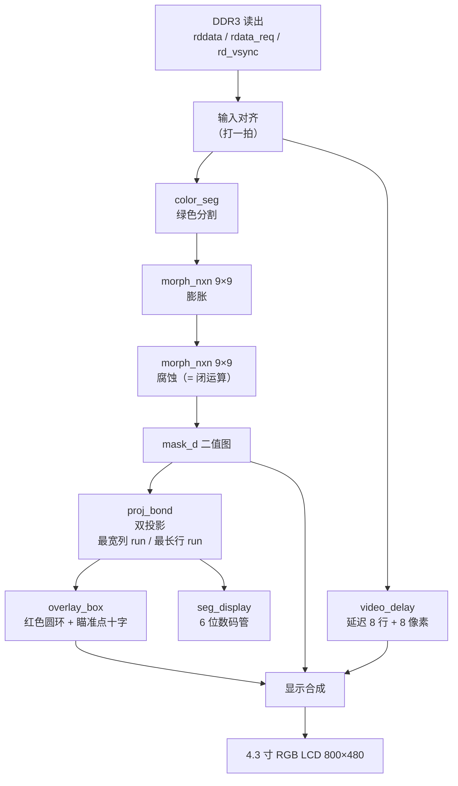
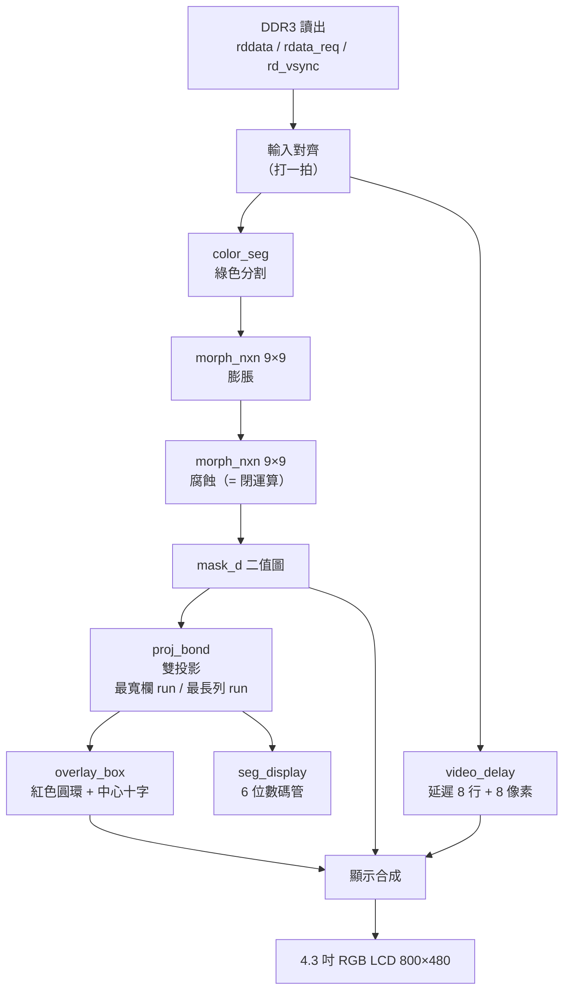

# FPGA4dart

**English** ｜ [简体中文](#简体中文说明) ｜ [繁體中文](#繁體中文說明)

A bold attempt at using FPGA / ZYNQ to enable the **DART robot** in RoboMaster.
This repository currently contains a **pure-Verilog vision pipeline** (no neural network):
the dart target is **one big green circular lamp**, so the pipeline segments green (absolute
difference test **plus** a scale-invariant relative-saturation gate), cleans it up with morphology,
locates the circle by **dual projection of the histogram outer edges**, and draws a **red ring +
aim-point cross** onto a 4.3" RGB LCD. A 6-digit 7-segment display shows the thresholds live.

The pipeline is hardened against the panel's specular glare by two **scale-invariant** algorithm
measures — a relative-saturation gate, and a projection that takes the **outer edges** of the
histograms so a glare hole punched through the lamp can no longer split the bounding box in half.
The dart project additionally pins the camera to a **fixed exposure**; that lock ships here too
(`tools/patch_camera_lock.py`), but it is **off by default** (`CAM_LOCK_EN = 1'b0`) — it needs
per-room calibration, and a bad value shows up as a **black screen** (§9) — while the algorithm
measures already carry the anti-glare duty on their own.

Built on top of the ALIENTEK (正点原子) Da Vinci **XC7A35T** example project *39_ov5640_lcd*
(`OV5640 → DDR3 frame buffer → RGB LCD`).

```
OV5640 (RGB565 800×480) → DDR3 ping-pong buffer → [ green seg → morphology → dual projection → overlay ] → LCD
                                                                                    └→ 6-digit 7-seg
```

| | |
|---|---|
| **Board** | ALIENTEK Da Vinci XC7A35TFGG484-2 (Artix-7: 20,800 LUT / 41,600 FF / 1,800 Kb BRAM / 90 DSP) |
| **Camera** | OV5640, RGB565, 800×480 |
| **Display** | 4.3" RGB LCD, 800×480, pixel clock 25 MHz (1:1, no scaling) |
| **Tool** | Vivado 2020.2 |
| **Verification** | `xsim` self-checking testbench — 44/44 checks pass (incl. a glare-band regression test) |
| **Synthesis** | 0 errors / 0 warnings / 0 latches — LUT 3332 (16.0%), FF 750 (1.8%), LUTRAM 2114, DSP 4, BRAM 0 |
| **Reference** | color test from the dart2026 open-source FPGA IP (`Threshold.v`); fixed-exposure approach from its `hikrobot.cpp` |
| **License** | MIT (see [LICENSE](LICENSE)) |

### Repository layout

```
FPGA4dart/
├── rtl/            # Verilog sources (GBK encoded, see "Encoding" below)
├── sim/            # testbench + one-click xsim script
├── prj/            # Vivado project (ov5640_lcd.xpr + ov5640_lcd.srcs)
├── doc/            # design notes, block diagram source, synthesis reports
│   └── vision_pipeline.md      # deep-dive design document (Chinese)
├── tools/          # dev scripts (sim / synth / encoding / path checks)
├── _backup_before_vision/      # stock example files, for rollback
└── _backup_before_green/       # files from before the green-target change
```

### Quick start

```powershell
# 1) RTL simulation (no DDR3 / IP needed, ~1 minute)
cd sim
.\run_vision_sim.bat

# 2) Resource check (out-of-context synthesis of the vision pipeline)
vivado -mode batch -source tools/synth_check_vision.tcl

# 3) On the board
#    open prj/ov5640_lcd.xpr → Generate Output Products → Run Synthesis
#    → Run Implementation → Generate Bitstream → Program device
```

Keys: `key[0]` pick which threshold to tune · `key[1]`/`key[2]` ±8 · `key[3]` binary view.
LEDs: `led[0..2]` which threshold is selected · `led[3]` target detected (solid) / not detected (blinks).
7-segment: `[1/2/3] 000  0 0` = selected threshold id, its value, and blob width ÷ 10.

---

## 简体中文说明

> 飞镖（dart）的靶标是**一个大绿色圆形灯**。本工程在官方 **39_ov5640_lcd** 例程的
> 「DDR3 读出」与「LCD 写入」之间插入一条纯 Verilog 视觉管线：绿色分割 → 形态学闭运算 →
> **双投影找绿块** → 红色圆环 + 中心十字，并把三个颜色阈值显示在板载 6 位数码管上。
> 深入设计说明（时序关系、双投影原理、Vivado LUTRAM 推断踩坑）请看 **[doc/vision_pipeline.md](doc/vision_pipeline.md)**。

### 1. 功能

| 功能 | 说明 |
|---|---|
| 绿色分割 | RGB565 → 1bit 二值图。**两道闸**：绝对判据 `G>=TH_G && G-R>=TH_G-R && G-B>=TH_G-B`（借自 dart 的 `Threshold.v`）+ **相对饱和度** `100*(max-min) >= max*20%`（尺度无关，抗反光） |
| 形态学去噪 | 9×9 膨胀 → 9×9 腐蚀 = **闭运算**，填补绿圆内部小洞、去掉碎点 |
| 目标定位 | **双投影取外沿**：X 直方图取第一个/最后一个 ≥ `TH_MIN` 的列 → 左右边界，Y 同理 → 上下边界。**抗反光**：反射在灯上打出的洞不会把框切成两半 |
| 圆形状校验 | 宽高都 ≥ `MIN_SIZE`、宽高比在 2:1 内、峰列高度 ≥ 高度的一半 —— 挡掉杂色块、「两块分开的绿块」 |
| 瞄准点 | 打击点在绿灯**上方一点** → 把圆心往上偏移 `宽度 × AIM_H_Q8/256` 像素（默认 1/4）。**不需要额外测距**，距离已被「表观宽度」隐含（推导见 §7） |
| 相机抗反光 | **默认靠算法**（下面两道尺度无关的闸）。另附**可选**的相机固定曝光 `CAM_LOCK_EN`：默认 `1'b0` 保持原厂自动曝光；固定曝光要按现场亮度标定，标错会「黑屏」，见 §9 |
| 标记输出 | **红色圆环**套住绿灯（半径 = (宽+高)/4，环宽 ±`RING_T`）+ **瞄准点红色十字**；另可切纯二值图模式方便调阈值 |
| 数码管 | 6 位共阳数码管实时显示「阈值编号 + 选中阈值(000~255) + 目标宽度/10」（宽度同时也是测距的原料） |
| 状态指示 | 4 颗 LED：当前在调哪个阈值（3 颗）、检测到目标（常亮 / 未检测到时 1.5Hz 闪） |

### 2. 硬件与环境

| 项目 | 内容 |
|---|---|
| FPGA | 正点原子达芬奇 **XC7A35TFGG484-2**（20,800 LUT / 41,600 FF / 1,800Kb BRAM / 90 DSP） |
| 相机 | OV5640，RGB565，800×480（DVP 接口） |
| 显示 | 4.3 寸 800×480 RGB LCD（`lcd_id` = `0x7084` / `0x4384`，像素时钟 25 MHz） |
| 数码管 | 板载 6 位共阳数码管：`seg_sel[5:0]` 位选（低电平选通）、`seg_led[7:0] = {dp,g,f,e,d,c,b,a}`（低电平点亮） |
| 开发工具 | Vivado 2020.2（仿真器 xsim） |
| 按键引脚 | `key[3:0]` = T1 / U1 / W2 / T3（**低电平有效**） |
| LED 引脚 | `led[3:0]` = R2 / R3 / V2 / Y2（**低电平点亮**） |
| 数码管引脚 | `seg_sel[5:0]` = J15 / H17 / H13 / G17 / H18 / G18；`seg_led[7:0]` = H15 / G16 / L13 / G15 / K13 / G13 / H14 / J14 |
| 复位 | `sys_rst_n` = U2 |

### 3. 目录结构

```
FPGA4dart/
├── rtl/                 # Verilog 源代码（GBK 编码）
│   ├── armor_vision.v   #   视觉管线顶层
│   ├── color_seg.v      #   绿色分割（纯组合逻辑）
│   ├── morph_nxn.v      #   N×N 膨胀 / 腐蚀
│   ├── line_buffer.v    #   单行缓冲（LUTRAM 标准模板）
│   ├── video_delay.v    #   像素流延迟（原图对齐）
│   ├── proj_bond.v      #   双投影找绿块 + 边界框 / 圆心
│   ├── overlay_box.v    #   红色圆环 + 中心十字
│   ├── seg_display.v    #   6 位数码管驱动
│   ├── vision_cfg.v     #   按键 → 三个阈值 / 显示模式
│   ├── key_debounce.v   #   按键同步 + 消抖 + 按下沿
│   └── (官方 39 例程原有的 13 个文件)
├── sim/                 # tb_armor_vision.v + run_vision_sim.bat（一键 xsim）
├── prj/                 # ov5640_lcd.xpr + ov5640_lcd.srcs（IP 的 .xci 都在）
├── doc/                 # vision_pipeline.md、框图 vsdx、综合资源报告
├── tools/               # 开发脚本（见第 12 节）
├── _backup_before_vision/   # 未加入视觉前的原始 39 例程文件（还原用）
└── _backup_before_green/    # 改成绿色靶标前的文件（还原用）
```

> 注：`.gen` / `.runs` / `.hw` / `.sim` / `.cache` / `.ip_user_files` 这些**可由源代码重建**的目录没有纳入版本控制（见 `.gitignore`）。
> 第一次打开 Vivado 工程时它会自动重新生成 IP output products。

### 4. 系统架构



**三个关键设计决定**

1. **用双投影取代连通域标记（CCL）**：靶标只有**一个**大绿圆，X / Y 两个 1D 直方图就能把它框住。
   资源只要 `800×10bit + 480×10bit` 的 LUTRAM，没有等价类合并、label 回收这些容易出错的逻辑，
   调试时直方图数值可以直接看。（dart 工程用的是完整 CCL `FindBond.v`，本工程是它的轻量替代。）
2. **形态学窗口是「右下角对齐」**：二值图在屏幕上会整体往右下偏移 `N-1 = 8` 像素，
   所以用 `video_delay` 把**原图也延迟 8 行 + 8 像素**，两者在屏幕上完全对齐，圆环才不会画歪。
3. **投影取「外沿」而不是「最长区间」**：反射会在灯上打出一个横贯的洞，取最长连续区间会把灯切成两半
   （实测洞高 10px 就让框高从 199 掉到 94、圆心整体上移 50 多像素 —— 看起来就是「识别不到」）。
   改取「第一个 / 最后一个 ≥ `TH_MIN` 的位置」只关心外沿，洞完全不影响；
   代价是对「两块分开的绿块」更敏感，所以形状校验里的宽高比 + 峰值高度必须留着。

**时间关系**：直方图在有效显示行累加；帧末（`rd_vsync` 后的垂直消隐）先扫 X（801 拍）再扫 Y（481 拍），
共约 1283 拍；垂直消隐有约 47000 拍（1056 × 45），非常宽裕。
X 与 Y 在**同一帧**算完，所以**框不再慢一帧**（第一帧末就能出框）。

### 5. 仿真验证

```powershell
cd sim
.\run_vision_sim.bat
# 等同于： xvlog <设计文件...> ; xelab -debug typical tb_armor_vision -s tb_vision ; xsim tb_vision -runall
```

测试台造出与 `lcd_driver`（800×480 面板）**完全相同**的时序，图像为
**一个绿色实心圆**（圆心 (400,240)、半径 100、`RGB565 = 0x750E` → `r8=118 g8=162 b8=118`，
即 `G-R = G-B = 44`），并验证 **44 项**：

| 阶段 | 检查 | 期望 | 说明 |
|---|---|---|---|
| 1 | `bond_l` / `bond_r` | 309 / 507 | 圆心 + 形态学偏移 8 后是 (408,248)，半径 100 |
| 1 | `bond_t` / `bond_b` | 149 / 347 | 上下同理 |
| 1 | `center_x` / `center_y` | 408 / 248 | 圆心 |
| 1 | `bond_w` | 199 | 一列弦长 ≥ `TH_MIN=4` 要求 `\|d\| <= 99` |
| 1 | `aim_x` / `aim_y` | 408 / **199** | 瞄准点 = 圆心往上 `199×64/256 = 49` 像素 |
| 1 | `inside_green` | `0x750E` | 圆内：命中 → 保持原色（不变暗） |
| 1 | `bg_dim` | `0x4208` | 圆外背景：未命中 → 亮度减半 |
| 1 | `ring_red` | `0xF800` | 圆环上 (507,248)，`dx=99` 落在 97..101 环带 |
| 1 | `cctr_green` | `0x750E` | 圆心不再画十字（十字已经移到瞄准点） |
| 1 | `aim_red` | `0xF800` | 瞄准点 (408,199) 上是红色十字 |
| 2 | `bond_*` / `center_y` | 310/506/149/347，cy=248 | **眩光回归测试**：盖一条横贯圆心的白带（py 225..255） |
| 2 | `bond_w` | 197 | 眩光让左右各内缩 1 像素（边缘列被吃掉了） |
| 2 | 撤掉眩光后 | 309 / 原色 / 红环 | 必须完全恢复 |
| 3 | `sel` | 1 | 按 `key[0]` 一次 → 选中项切到 `TH_G-R` |
| 4 | `th_gr` / `bond_valid` | 48 / 0 | 按 `key[1]` 两次 → `TH_G-R` 48 > 44 → **目标丢失** |
| 5 | `th_gr` / `bond_valid` | 32 / 1 | 按 `key[2]` 两次 → 阈值回来 → **恢复检测** |
| 6 | `sel` | 2 | 再按 `key[0]` 一次 → 选中项切到 `TH_G-B` |
| 7 | `disp_bin` / `bin_white` | 1 / `0xFFFF` | 按 `key[3]` → 纯二值模式，圆内显示白色 |

实测输出：`==== ALL CHECKS PASSED ====`（44 项）。

> **阶段 2 是关键回归**：旧版「取最长连续 run」的投影在这里会退化成
> `h≈84`、`center_y≈190`（框只剩上半边）—— 那就是「转一点角度就识别不到」的现场。
> 改成「取外沿」后，眩光带高 60px 也仍然给出正确的 149/347、圆心 y=248。

> 期望值的推导：形态学窗口「右下角对齐」，膨胀+腐蚀后二值图整体往右下偏 8 像素，
> 所以二值图上圆心是 (400+8, 240+8) = (408,248)、半径仍是 100。
> `TH_MIN=4`：一列弦长 `2*sqrt(100²-d²) >= 4` 要求 `|d| <= 99`，于是左右 = `408±99` = [309,507]、
> 上下 = `248±99` = [149,347]，宽高都是 199。
> 这套期望值有独立推演：`tools/model_morph.py` 里的 Python 参考模型会跑出同样的数字。

### 6. 按键 / LED / 数码管

绿色判据有**三个**阈值（`TH_G`、`TH_G-R`、`TH_G-B`），所以 `key[0]` 改成「选哪个阈值」，
`key[1]`/`key[2]` 对选中的那一颗做加减：

| 按键 | 引脚 | 功能 |
|---|---|---|
| `key[0]` | T1 | 循环选择要调的阈值：`TH_G` → `TH_G-R` → `TH_G-B` → `TH_G` |
| `key[1]` | U1 | 当前选中的阈值 +8（上限 255） |
| `key[2]` | W2 | 当前选中的阈值 −8（下限 0） |
| `key[3]` | T3 | 显示模式切换（0 = 原图变暗+标记；1 = 纯二值图） |

| LED | 引脚 | 含义 |
|---|---|---|
| `led[0]` | R2 | 当前在调 `TH_G` |
| `led[1]` | R3 | 当前在调 `TH_G-R` |
| `led[2]` | V2 | 当前在调 `TH_G-B` |
| `led[3]` | Y2 | 检测到目标常亮；未检测到时 1.5 Hz 闪烁（顺便当心跳） |

**6 位数码管**（位序从右往左，`dig5` 是最左）：

| 位 | 显示 |
|---|---|
| `dig5` | 当前选中的阈值编号 `1` / `2` / `3`；**这一位的小数点亮 = 纯二值图显示模式** |
| `dig4`~`dig2` | 选中阈值的十进制值（`000`~`255`） |
| `dig1`~`dig0` | 目标边界框宽度 ÷ 10；**没检测到目标时这两位熄灭** |

例：`0 1 0 3 2 7 1 9` → 阈值编号 3、阈值 010、目标宽 199 像素。

### 7. 颜色判据与可调参数

RGB565 先展成 8bit：`r8={R5,R5[4:2]}`、`g8={G6,G6[5:4]}`、`b8={B5,B5[4:2]}`

**闸 1（绝对判据，借自 dart 的 `Threshold.v`）**：

| 判据 | 条件 |
|---|---|
| 绿 | `(g8 >= TH_G) && (g8-r8 >= TH_G-R) && (g8-b8 >= TH_G-B)` |

三个判断式用的都是**带符号差值**，所以「白」「灰」（`G-R ≈ 0`）不会被误判成绿。
dart 那边是 10bit 影像、默认 `400 / 130 / 130`，折算到 8bit 就是本工程的 `100 / 32 / 32`。

**闸 2（相对饱和度，本工程为抗反光新加，尺度无关）**：

```
mx = max(r8,g8,b8)   mn = min(r8,g8,b8)   chro = mx - mn
100*chro >= mx * REL_SAT_PCT        // 默认 20（%）
```

闸 1 是**绝对**差值。LCD 面板有光泽，一旦被房间灯照出镜面反射，相机 AEC 会把整帧曝光拉走（全画面变暗）、
AWB 会把白平衡推走（差值整体缩小），于是**局部眩光被放大成「整个目标消失」**。
闸 2 只看「色度占最亮通道的比例」：整体变暗/变淡时分子分母同比例缩放，判据不变；
白光眩光 `chro ≈ 0`，会被干脆地排除。把 `REL_SAT_PCT` 设成 0 就关掉闸 2（回到纯 dart 判据）。

**闸 2 是本工程抗反光的主力**：它让判据对相机自动曝光 / 自动白平衡的漂移免疫，
所以**即使相机保持原厂自动（默认）也能撑住**，不依赖任何需要现场标定的手调寄存器。

### 7.1 瞄准点：为什么不需要额外测距

靶标的实际打击点在绿色灯**上方一点**（设物理偏移 Δh，灯的实际直径 Dt）。针孔模型下：

$$
W = f_{px}\cdot\frac{D_t}{D}\;(\text{灯的表观宽度})\qquad \Delta_{pix} = f_{px}\cdot\frac{\Delta h}{D}\;(\text{打击点的像素偏移})
$$

两式相除，**距离 D 直接消掉**：

$$
\Delta_{pix} = W\cdot\frac{\Delta h}{D_t}
$$

也就是说：**像素偏移只跟「表观宽度」成正比**，比例系数就是「物理偏移 / 灯直径」。
所以只要标定这个比例（`AIM_H_Q8`，Q0.8 定点，默认 64 = 1/4），就能直接算瞄准点，
不需要单独测距 —— 距离信息已经隐含在宽度里了。

> **dart 工程怎么做的**：它的相机看的也是灯心，另外叠一个**角度**偏移。
> 距离由「目标的表观**面积**」查表得到（`alg_proportional_navigation.c`：
> `photo_target_distance = lookup(area_to_distance, (w-8)*(h-8))`，表定义在 `lib_table.h`，
> 500 点、50cm~1500cm，`area ∝ 1/D²`），再拿它去查弹道/下坠曲线
> （`task_control.c` 的 `target_atatact_theta = 30 - (10/400)*distance + ...`，
> 以及 `WORLD_VFOV_ADD_ANGLE_RAD_MAX/MIN = 10°/3°`）。
> 结论：**dart 确实要距离**，但它是从「表观尺寸」反推的，不是靠额外传感器；
> 而「打击点比灯高一点」这种**目标本身的几何偏移**，用宽度就够了（上面的公式）。
> 真正必须知道距离的是**弹道下坠**——那是飞控侧的事，本视觉管线不做。

> 数码管上「目标宽度 ÷ 10」那两位就是测距的原料：宽度 × 距离 ≈ 常数（灯的实际直径固定）。

参数都在 `armor_vision.v` 的 parameter（改完重新综合即可）：

| 参数 | 默认 | 调整建议 |
|---|---|---|
| `TH_G_DEF` | 100 | 绿色亮度下限。**灯亮但检测不到**先调它（dart 的 400/4） |
| `TH_GR_DEF` | 32 | `G-R` 差值下限。受环境光/白平衡影响最大（dart 的 130/4） |
| `TH_GB_DEF` | 32 | `G-B` 差值下限 |
| `REL_SAT_PCT` | 20 | 相对饱和度下限（%）。**抗反光闸**；设 0 = 关闭 |
| `TH_MIN` | 4 | 投影阈值：一列/一行的最少亮点数。「取外沿」用它判定哪一列/行算数 |
| `MIN_SIZE` | 24 | 目标最小边长（宽、高都要 ≥ 它），挡小碎点 |
| `AIM_H_Q8` | 64 | 瞄准点在灯心上方 = 宽度 × (AIM_H_Q8/256)。**现场标定**：量「打击点到灯心」和「灯直径」的比 |
| `MORPH_N` | 9 | 形态学窗口（dart 用 9）。噪点多→9；想省资源→5 或 3（延迟行数跟着减半） |
| `RING_T` | 2 | 圆环半宽（像素） |
| `CROSS_L` | 12 | 瞄准点十字臂长（像素） |
| `CLK_FREQ` | 25000000 | 只用于按键消抖时间（4.3" 800×480 的 `lcd_clk` = 25MHz） |

### 8. 资源使用（Vivado 2020.2，`armor_vision` out-of-context 综合）

| 模块 | LUT | 其中 LUTRAM | FF | DSP |
|---|---|---|---|---|
| `video_delay`（8 行 × 800 × 16bit） | 1999 | 1664 | 128 | 0 |
| `proj_bond`（两个直方图） | 595 | 242 | 135 | 0 |
| `morph_nxn` ×2 | 182 + 176 | 208 | 144 | 0 |
| `vision_cfg`（四颗按键消抖） | 158 | 0 | 119 | 0 |
| `color_seg`（绝对判据 + 相对饱和度） | 90 | 0 | 0 | 0 |
| `overlay_box`（圆环两个平方 + 十字） | 56 | 0 | 0 | 4 |
| `seg_display` | 32 | 0 | 19 | 0 |
| 顶层与显示合成 | 44 | 0 | 205 | 0 |
| **合计** | **3332（16.0%）** | 2114 | **750（1.8%）** | **4（4.4%）** |

Block RAM 0。原 39 例程（DDR3 MIG + FIFO + 相机 + LCD）的资源仍然充裕。
完整报告：`doc/synth_utilization_vision.rpt`、`doc/synth_utilization_hier.rpt`。

> **踩过的坑（很重要）**：一开始把行缓冲写成 `reg [WW-1:0] buf [0:NL-1][0:WIDTH-1]`，
> 读取放在 `always @(*)`、写入放在另一个时序区块，Vivado **不会**把它推断成 LUTRAM，
> 而是退化成「触发器 + 800 选 1 大 mux」——实测整个管线炸到
> **LUT 15747（75.7%）、FF 21684（52.1%）**，加进原工程一定塞不下。
> 改成 `line_buffer.v`（**同步写 + `assign dout = mem[raddr]` 连续赋值读**这个标准模板）
> 之后降到 **LUT 3168（15.2%）、FF 805（1.9%）**。
> 若之后要再加行缓冲/存储器，一律走 `line_buffer` 这个模板
> （`proj_bond.v` 里那两个直方图也是这样推出来的，实测 LUTRAM = 210）。

### 9. 常见问题 / 调试

| 症状 | 处理 |
|---|---|
| 完全没标记、`led[3]` 一直闪 | ① 按 `key[3]` 切纯二值图，用 `key[0]`+`key[1]`/`key[2]` 把绿色调干净 ② 看数码管确认阈值 ③ `TH_MIN` / `MIN_SIZE` 是否设太大 |
| 二值图里绿圆是**白色一片** | 相机曝光把灯打爆成白色了（饱和后 `G-R ≈ 0` 判不出颜色）→ 调小 `i2c_ov5640_rgb565_cfg.v` 里的曝光 `EXP_*` |
| **一转身屏幕角度就整个识别不到** | **已处理**：根因是 LCD 镜面反射 → OV5640 的 AEC/AWB 把整幅画面的亮度/色彩一起拉走，固定阈值全线失守。主力是两条**尺度无关**的算法措施：相对饱和度闸（`color_seg.v`）+ 「取外沿」投影（`proj_bond.v`），都不依赖相机设置。可选的相机固定曝光见下一行 |
| **屏幕全黑**（背光亮着但没图像） | ① 先按 `key[3]` 退出纯二值图模式 —— 没有绿目标时纯二值图本来就是全黑，1 秒可排除。② 若仍黑：**必是相机没出图**，因为 `lcd_driver.v` 里 `lcd_bl` 写死 `1'b1`（背光常亮），所以「黑」只能是像素数据本身是黑的。最常见原因是**相机改成了手动曝光而曝光值太小**（踩过这个坑：写死 `0x0200`，整屏黑）。修复：把 `CAM_LOCK_EN` 改回 `1'b0`，或 `Copy-Item _backup_before_green\rtl\i2c_ov5640_rgb565_cfg.v rtl\ -Force` |
| 想启用相机固定曝光 | 把 `rtl/i2c_ov5640_rgb565_cfg.v` 的 `CAM_LOCK_EN` 改成 `1'b1`，然后**上电看着 LCD** 调 `EXP_15_8`：太暗就加大（`0x01`→`0x02`→`0x04`→`0x08`…），过曝发白就减小，大致范围 `0x0100`（很暗）~ `0x2000`（很亮）；增益 `GAIN_7_0`（`0x10`=1x）。**换环境要重标**，这就是它默认关掉的原因 |
| 圆环/十字位置不对 | ① 环半径由 `(宽+高)/4` 得，先看二值图干不干净 ② 十字画在**瞄准点**上，位置由 `AIM_H_Q8` 决定，标定不准就调它 |
| 框跳来跳去 | 提高 `TH_G` / 把 `MIN_SIZE` 调大 / `MORPH_N` 调大 |
| 画面最上面 16 行有残影 | 行缓冲在帧首还没填满，检测端已用 `Y_GUARD` 排除；残影只是显示 |
| 数码管显示倒过来 | 板子位选顺序与本模块假设相反 → 把 `seg_display.v` 的 `SEG_REV` 参数设成 `1` |
| 资源不够 / 时序不过 | `MORPH_N` 改 5 或 3 |

### 10. 已知限制与后续方向

- **只输出一个目标**：取 X/Y 直方图的外沿，画面里同时出现多个绿块时会把它们连成一个框（**会被形状校验挡住 → 不输出**）
  → 需要多目标就要上完整 CCL（可参考 dart 工程的 `FindBond.v`：256 标签 + BRAM 存每块结构 + 帧末选面积最大的）
- **没有弹道下坠补偿**：目前只给圆心与瞄准点（目标几何偏移），不含飞行下坠
  → 下坠是**角度**偏移、与距离和弹速都有关，属于飞控侧；dart 用「表观面积 → 距离 → 下坠曲线」两步算，
     本工程已经把「表观宽度」放在了数码管上，需要时可直接接过去
- **相机固定曝光是「选配」且默认关闭**：`CAM_LOCK_EN = 1'b0` 时相机保持原厂自动曝光 / 自动白平衡，
  抗反光完全由两条尺度无关的算法措施承担。想要 dart 那种「曝光锁死」的极致稳定性，
  把 `CAM_LOCK_EN` 打开并按现场亮度标定一次（换环境要重标 —— 这是拿通用性换稳定性）
- 其他可延伸：瞄准点经 UART 送给云台 / 加 ILA 观察两个直方图峰值
- 对应《RM飞镖FPGA视觉方案》文件的阶段 1~6 皆已完成（验证对照表见 `doc/vision_pipeline.md`）

### 11. 还原

改成绿色靶标**之前**的文件在 `_backup_before_green/`：

```powershell
Copy-Item _backup_before_green\rtl\*.v                      rtl\        -Force
Copy-Item _backup_before_green\prj\ov5640_lcd.srcs\constrs_1\new\pin.xdc prj\ov5640_lcd.srcs\constrs_1\new\ -Force
Copy-Item _backup_before_green\sim\tb_armor_vision.v        sim\        -Force
Copy-Item _backup_before_green\README.md                    .\          -Force
Copy-Item _backup_before_green\vision_pipeline.md           doc\        -Force
```

只把**相机固定曝光**单独退回去：

```powershell
# 方式一（推荐）：把 CAM_LOCK_EN 改成 1'b0 —— 等价于原厂行为，别的都不用动
# 方式二：整个文件退回原厂版本（相机配置就完全回到 39 例程）
Copy-Item _backup_before_green\rtl\i2c_ov5640_rgb565_cfg.v rtl\ -Force
```

未加入视觉管线**之前**的原始 39 例程文件在 `_backup_before_vision/`：

```powershell
Copy-Item _backup_before_vision\ov5640_lcd.v.bak   rtl\ov5640_lcd.v -Force
Copy-Item _backup_before_vision\pin.xdc.bak        prj\ov5640_lcd.srcs\constrs_1\new\pin.xdc -Force
Copy-Item _backup_before_vision\ov5640_lcd.xpr.bak prj\ov5640_lcd.xpr -Force
```

若之后又从官方例程复制一份干净的 39 工程，可执行 `python tools/patch_project.py` 接回视觉管线，
再执行 `python tools/patch_green.py` 接上绿色靶标这一版。

### 12. 开发工具（`tools/`）

| 脚本 | 用途 |
|---|---|
| `run_vision_sim.bat`（在 `sim/`） | 一键跑 xsim 自检（编译 → 精化 → 仿真） |
| `synth_check_vision.tcl` | 对 `armor_vision` 做 out-of-context 综合，检查 LUTRAM 推断与资源 |
| `patch_project.py` | 把视觉管线接进官方 39 例程（已应用过，重复执行会自动跳过） |
| `patch_green.py` | 从「红蓝灯条」版升级到「绿色圆靶标」版（改 `ov5640_lcd.v` 埠/例化、`pin.xdc` 注释与数码管引脚、`xpr` 注册新文件；字节级安全，可重复执行） |
| `patch_camera_lock.py` | 加入**可选**的相机固定曝光 / 增益（只加 6 条寄存器：`0x3503` + 曝光×3 + 增益×2；**默认 `CAM_LOCK_EN = 1'b0` 即不启用**）。**完全不碰 AWB**（避免白平衡增益写错），并会自动清掉早期写坏 AWB 的版本；可重复执行 |
| `model_morph.py` | 视觉管线的 Python 参考模型：验证期望值是怎么来的、试算反光下的行为（不需要综合、不被 xsim 用到） |
| `to_gbk.py` | 新增文件的中文注释 UTF-8 → GBK（与工程其他文件一致） |
| `to_simplified_gbk.py` | 把代码档的中文由繁体转成简体、并统一存成 GBK（幂等，可重复执行；`--apply` 才写入） |
| `check_project_paths.py` | 检查 `.xpr` 引用的文件是否都在（搬移/复制工程后很好用） |

### 13. 编码注意（**很重要**）

- `rtl/*.v`、`prj/**/*.xdc` 等 Vivado 文件是 **GBK** 编码（Vivado 在中文 Windows 下用 ANSI）。
- `doc/*.md`、`tools/*.py` 是 **UTF-8**。
- 用 VS Code 编辑 `.v` 时请确认右下角编码是 `GBK`（VS Code 通常会自动检测）；
  若存成 UTF-8，Vivado 内置编辑器看到的中文注释会变乱码。
- 要**批量改 GBK 文件**不要用普通编辑器保存，请照 `tools/patch_green.py` 的做法
  用 Python（GBK 解码 → 改 → GBK 编码，写回前往返比对）或纯 ASCII 字节级替换。

### 14. 授权与致谢

- 本项目以 **MIT License** 发布（见 [LICENSE](LICENSE)）。
- 基础工程来自正点原子（ALIENTEK）官方 FPGA 例程 **39_ov5640_lcd**（OV5640 + DDR3 + RGB LCD）。
- 绿色判据与「形态学 + 找最大色块」的思路参考 2026 飞镖开源工程 `dart2026_-open-source`
  （`dart_-fpga/fpga/ip/isp/Threshold_ip/src/Threshold.v`、`FindBond_ip/src/FindBond.v`）。

---

## 繁體中文說明

> 為助力兩岸四地青年共圓工程夢，本專案特提供繁體中文版本 README。
> 以官方 **39_ov5640_lcd** 例程為起點，在「DDR3 讀出」與「LCD 寫入」之間插入一條純 Verilog 視覺管線：
> 綠色分割 → 形態學閉運算 → **雙投影找綠塊** → 紅色圓環 + 中心十字，並把三個門檻顯示在板載 6 位數碼管。
> 深入設計說明（時序關係、雙投影原理、Vivado LUTRAM 推斷踩坑）請看 **[doc/vision_pipeline.md](doc/vision_pipeline.md)**。

### 1. 功能

| 功能 | 說明 |
|---|---|
| 綠色分割 | RGB565 → 1bit 二值圖。**兩道閘**：絕對判據 `G>=TH_G && G-R>=TH_G-R && G-B>=TH_G-B`（借自 dart 的 `Threshold.v`）+ **相對飽和度** `100*(max-min) >= max*20%`（尺度無關，抗反光） |
| 形態學去噪 | 9×9 膨脹 → 9×9 腐蝕 = **閉運算**，填補綠圓內部小洞、去掉碎點 |
| 目標定位 | **雙投影取外沿**：X 直方圖取第一個/最後一個 ≥ `TH_MIN` 的欄 → 左右邊界，Y 同理 → 上下邊界。**抗反光**：反射在燈上打出的洞不會把框切成兩半 |
| 圓形狀校驗 | 寬高都 ≥ `MIN_SIZE`、寬高比在 2:1 內、峰欄高度 ≥ 高度的一半 —— 擋掉雜色塊、「兩塊分開的綠塊」 |
| 瞄準點 | 打擊點在綠燈**上方一點** → 把圓心往上偏移 `寬度 × AIM_H_Q8/256` 像素（預設 1/4）。**不需要額外測距**，距離已被「表觀寬度」隱含 |
| 相機抗反光 | **預設靠算法**（兩道尺度無關的閘）。另附**可選**的相機固定曝光 `CAM_LOCK_EN`：預設 `1'b0` 保持原廠自動曝光；固定曝光要按現場亮度標定，標錯會「黑屏」，見 §9 |
| 標記輸出 | **紅色圓環**套住綠燈（半徑 = (寬+高)/4，環寬 ±`RING_T`）+ **瞄準點紅色十字**；另可切純二值圖模式方便調門檻 |
| 數碼管 | 6 位共陽數碼管即時顯示「門檻編號 + 選中門檻(000~255) + 目標寬度/10」 |
| 狀態指示 | 4 顆 LED：目前在調哪個門檻（3 顆）、偵測到目標（常亮 / 未偵測到時 1.5Hz 閃） |

### 2. 硬體與環境

| 項目 | 內容 |
|---|---|
| FPGA | 正點原子達芬奇 **XC7A35TFGG484-2**（20,800 LUT / 41,600 FF / 1,800Kb BRAM / 90 DSP） |
| 相機 | OV5640，RGB565，800×480（DVP 介面） |
| 顯示 | 4.3 吋 800×480 RGB LCD（`lcd_id` = `0x7084` / `0x4384`，像素時鐘 25 MHz） |
| 數碼管 | 板載 6 位共陽數碼管：`seg_sel[5:0]` 位選（低電平選通）、`seg_led[7:0] = {dp,g,f,e,d,c,b,a}`（低電平點亮） |
| 開發工具 | Vivado 2020.2（模擬器 xsim） |
| 按鍵腳位 | `key[3:0]` = T1 / U1 / W2 / T3（**低電平有效**） |
| LED 腳位 | `led[3:0]` = R2 / R3 / V2 / Y2（**低電平點亮**） |
| 數碼管腳位 | `seg_sel[5:0]` = J15 / H17 / H13 / G17 / H18 / G18；`seg_led[7:0]` = H15 / G16 / L13 / G15 / K13 / G13 / H14 / J14 |
| 復位 | `sys_rst_n` = U2 |

### 3. 目錄結構

```
FPGA4dart/
├── rtl/                 # Verilog 原始碼（GBK 編碼）
│   ├── armor_vision.v   #   視覺管線頂層
│   ├── color_seg.v      #   綠色分割（純組合邏輯）
│   ├── morph_nxn.v      #   N×N 膨脹 / 腐蝕
│   ├── line_buffer.v    #   單行緩衝（LUTRAM 標準模板）
│   ├── video_delay.v    #   像素串流延遲（原圖對齊）
│   ├── proj_bond.v      #   雙投影找綠塊 + 邊界框 / 圓心
│   ├── overlay_box.v    #   紅色圓環 + 中心十字
│   ├── seg_display.v    #   6 位數碼管驅動
│   ├── vision_cfg.v     #   按鍵 → 三個門檻 / 顯示模式
│   ├── key_debounce.v   #   按鍵同步 + 消抖 + 按下沿
│   └── (官方 39 例程原有的 13 個檔案)
├── sim/                 # tb_armor_vision.v + run_vision_sim.bat（一鍵 xsim）
├── prj/                 # ov5640_lcd.xpr + ov5640_lcd.srcs（IP 的 .xci 都在）
├── doc/                 # vision_pipeline.md、方塊圖 vsdx、合成資源報告
├── tools/               # 開發腳本（見第 12 節）
├── _backup_before_vision/   # 未加入視覺前的原始 39 例程檔案（還原用）
└── _backup_before_green/    # 改成綠色靶標前的檔案（還原用）
```

### 4. 系統架構



**三個關鍵設計決定**

1. **用雙投影取代連通域標記（CCL）**：靶標只有**一個**大綠圓，X / Y 兩個 1D 直方圖就能把它框住。
   資源只要 `800×10bit + 480×10bit` 的 LUTRAM，沒有等價類合併、label 回收這些容易出錯的邏輯。
2. **形態學窗口是「右下角對齊」**：二值圖在螢幕上會整體往右下偏移 `N-1 = 8` 像素，
   所以用 `video_delay` 把**原圖也延遲 8 行 + 8 像素**，兩者在螢幕上完全對齊。
3. **環與十字畫在同一像素串流座標上**：`proj_bond` 統計出來的座標就是螢幕座標，`overlay_box` 直接比對。

**時間關係**：直方圖在有效顯示行累積；幀末先掃 X（801 拍）再掃 Y（481 拍），共約 1283 拍；
垂直消隱有約 47000 拍，非常寬裕。X 與 Y 在**同一幀**算完，所以**框不再慢一幀**。

### 5. 模擬驗證

```powershell
cd sim
.\run_vision_sim.bat
# 等同於： xvlog <設計檔...> ; xelab -debug typical tb_armor_vision -s tb_vision ; xsim tb_vision -runall
```

測試台造出與 `lcd_driver`（800×480 面板）**完全相同**的時序，影像為
**一個綠色實心圓**（圓心 (400,240)、半徑 100、`RGB565 = 0x750E` → `r8=118 g8=162 b8=118`），並驗證 **44 項**：

| 階段 | 檢查 | 期望 | 說明 |
|---|---|---|---|
| 1 | `bond_l` / `bond_r` | 309 / 507 | 圓心 + 形態學偏移 8 後是 (408,248)、半徑 100 |
| 1 | `bond_t` / `bond_b` | 149 / 347 | 上下同理 |
| 1 | `center_x` / `center_y` | 408 / 248 | 圓心 |
| 1 | `bond_w` | 199 | 一欄弦長 ≥ `TH_MIN=4` 要求 `\|d\| <= 99` |
| 1 | `aim_x` / `aim_y` | 408 / **199** | 瞄準點 = 圓心往上 `199×64/256 = 49` 像素 |
| 1 | `inside_green` / `bg_dim` | `0x750E` / `0x4208` | 圓內保持原色；圓外變暗 |
| 1 | `ring_red` / `cctr_green` / `aim_red` | `0xF800` / `0x750E` / `0xF800` | 環上是紅的、圓心不再畫十字、瞄準點上是紅十字 |
| 2 | `bond_*` / `center_y` | 310/506/149/347，cy=248 | **眩光回歸測試**：蓋一條橫貫圓心的白帶（py 225..255） |
| 2 | `bond_w` | 197 | 眩光讓左右各內縮 1 像素 |
| 3 | `sel` | 1 | 按 `key[0]` 一次 → 選中項切到 `TH_G-R` |
| 4 | `th_gr` / `bond_valid` | 48 / 0 | 按 `key[1]` 兩次 → 48 > 44 → **目標遺失** |
| 5 | `th_gr` / `bond_valid` | 32 / 1 | 按 `key[2]` 兩次 → 門檻回來 → **恢復偵測** |
| 6 | `sel` | 2 | 再按 `key[0]` 一次 → 選中項切到 `TH_G-B` |
| 7 | `disp_bin` / `bin_white` | 1 / `0xFFFF` | 按 `key[3]` → 純二值模式，圓內顯示白色 |

實測輸出：`==== ALL CHECKS PASSED ====`（44 項）。

> **階段 2 是關鍵回歸**：舊版「取最長連續 run」的投影在這裡會退化成 `h≈84`、`center_y≈190`
> （框只剩上半邊）—— 那就是「轉一點角度就識別不到」的現場。改成「取外沿」後，
> 眩光帶高 60px 也仍然給出正確的 149/347、圓心 y=248。

> 期望值有獨立推演：`tools/model_morph.py` 的 Python 參考模型會跑出同樣的數字。

### 6. 按鍵 / LED / 數碼管

| 按鍵 | 腳位 | 功能 |
|---|---|---|
| `key[0]` | T1 | 循環選擇要調的門檻：`TH_G` → `TH_G-R` → `TH_G-B` → `TH_G` |
| `key[1]` | U1 | 當前選中的門檻 +8（上限 255） |
| `key[2]` | W2 | 當前選中的門檻 −8（下限 0） |
| `key[3]` | T3 | 顯示模式切換（0 = 原圖變暗+標記；1 = 純二值圖） |

| LED | 腳位 | 意義 |
|---|---|---|
| `led[0]` | R2 | 目前在調 `TH_G` |
| `led[1]` | R3 | 目前在調 `TH_G-R` |
| `led[2]` | V2 | 目前在調 `TH_G-B` |
| `led[3]` | Y2 | 偵測到目標常亮；未偵測到時 1.5 Hz 閃爍 |

**6 位數碼管**（位序從右往左，`dig5` 是最左）：

| 位 | 顯示 |
|---|---|
| `dig5` | 門檻編號 `1` / `2` / `3`；**小數點亮 = 純二值圖顯示模式** |
| `dig4`~`dig2` | 選中門檻的十進位值（`000`~`255`） |
| `dig1`~`dig0` | 目標邊界框寬度 ÷ 10；**沒偵測到目標時這兩位熄滅** |

### 7. 顏色判據與可調參數

RGB565 先展成 8bit：`r8={R5,R5[4:2]}`、`g8={G6,G6[5:4]}`、`b8={B5,B5[4:2]}`

| 判據 | 條件 |
|---|---|
| 綠 | `(g8 >= TH_G) && (g8-r8 >= TH_G-R) && (g8-b8 >= TH_G-B)` |

三個判斷式用的都是**帶符號差值**，所以「白」「灰」不會被誤判成綠。
這個形式直接借自 dart 工程的 `Threshold.v`（10bit 預設 `400 / 130 / 130`），折算到 8bit 就是 `100 / 32 / 32`。

| 參數 | 預設 | 調整建議 |
|---|---|---|
| `TH_G_DEF` | 100 | 綠色亮度下限。**燈亮但偵測不到**先調它 |
| `TH_GR_DEF` | 32 | `G-R` 差值下限。受環境光/白平衡影響最大 |
| `TH_GB_DEF` | 32 | `G-B` 差值下限 |
| `REL_SAT_PCT` | 20 | 相對飽和度下限（%）。**抗反光閘**；設 0 = 關閉 |
| `TH_MIN` | 4 | 投影門檻：一欄/一列的最少亮點數 |
| `MIN_SIZE` | 24 | 目標最小邊長，擋小碎點 |
| `AIM_H_Q8` | 64 | 瞄準點在燈心上方 = 寬度 × (AIM_H_Q8/256)。**現場標定** |
| `MORPH_N` | 9 | 形態學窗口；想省資源 → 5 或 3 |
| `RING_T` | 2 | 圓環半寬（像素） |
| `CROSS_L` | 12 | 瞄準點十字臂長（像素） |
| `CLK_FREQ` | 25000000 | 只用於按鍵消抖時間 |

### 8. 資源使用

| 模組 | LUT | 其中 LUTRAM | FF | DSP |
|---|---|---|---|---|
| `video_delay` | 1999 | 1664 | 128 | 0 |
| `proj_bond` | 595 | 242 | 135 | 0 |
| `morph_nxn` ×2 | 182 + 176 | 208 | 144 | 0 |
| `vision_cfg` | 158 | 0 | 119 | 0 |
| `color_seg`（絕對判據 + 相對飽和度） | 90 | 0 | 0 | 0 |
| `overlay_box` | 56 | 0 | 0 | 4 |
| `seg_display` | 32 | 0 | 19 | 0 |
| 頂層與顯示合成 | 44 | 0 | 205 | 0 |
| **合計** | **3332（16.0%）** | 2114 | **750（1.8%）** | **4（4.4%）** |

Block RAM 0。原 39 例程的資源仍然充裕。完整報告：`doc/synth_utilization_vision.rpt`。

### 9. 常見問題 / 除錯

| 症狀 | 處理 |
|---|---|
| 完全沒有標記、`led[3]` 一直閃 | ① 按 `key[3]` 切純二值圖，把綠色調乾淨 ② `TH_MIN` / `MIN_SIZE` 是否設太大 |
| 二值圖裡綠圓是**白色一片** | 相機曝光把燈打爆成白色了 → 調小 `i2c_ov5640_rgb565_cfg.v` 裡的 `EXP_*` |
| **一轉螢幕角度就整個識別不到** | **已處理**：根因是 LCD 鏡面反射 → OV5640 的 AEC/AWB 把整幅畫面的亮度/色彩一起拉走。主力是兩條**尺度無關**的算法措施：相對飽和度閘（`color_seg.v`）+ 「取外沿」投影（`proj_bond.v`），都不依賴相機設定 |
| **螢幕全黑**（背光亮著但沒圖像） | ① 先按 `key[3]` 退出純二值圖模式 —— 沒有綠目標時純二值圖本來就是全黑，1 秒可排除。② 若仍黑：**必是相機沒出圖**，因為 `lcd_driver.v` 裡 `lcd_bl` 寫死 `1'b1`（背光常亮），所以「黑」只能是像素資料本身是黑的。最常見原因是**相機改成了手動曝光而曝光值太小**。修復：把 `CAM_LOCK_EN` 改回 `1'b0` |
| 標記位置不對 | ① 環半徑由 `(寬+高)/4` 得來，先看二值圖乾不乾淨 ② 十字畫在**瞄準點**上，位置由 `AIM_H_Q8` 決定 |
| 框跳來跳去 | 提高 `TH_G` / `MIN_SIZE` 調大 / `MORPH_N` 調大 |
| 畫面最上面 16 行有殘影 | 行緩衝在幀首還沒填滿，檢測端已用 `Y_GUARD` 排除 |
| 數碼管顯示倒過來 | 把 `seg_display.v` 的 `SEG_REV` 設成 `1` |
| 資源不夠 / 時序不過 | `MORPH_N` 改 5 或 3 |

### 10. 已知限制與後續方向

- **只輸出一個目標**：需要多目標就要上完整 CCL（可參考 dart 工程的 `FindBond.v`）
- **沒有距離/大小解算**：目前只給圓心與邊界框
- **顏色分割對光照敏感**：可加自適應門檻，或把判據改成「相對飽和度」讓整體變暗/變淡時依然成立
- 其他可延伸：圓心經 UART 送給上位機 / 加 ILA 觀察兩個直方圖峰值

### 11. 還原

改成綠色靶標**之前**的檔案在 `_backup_before_green/`；
未加入視覺管線**之前**的原始 39 例程檔案在 `_backup_before_vision/`（指令見簡體中文版第 11 節）。

### 12. 開發工具（`tools/`）

| 腳本 | 用途 |
|---|---|
| `run_vision_sim.bat`（在 `sim/`） | 一鍵跑 xsim 自檢 |
| `synth_check_vision.tcl` | 對 `armor_vision` 做 out-of-context 合成，檢查 LUTRAM 推斷與資源 |
| `patch_project.py` | 把視覺管線接進官方 39 例程（已套用過） |
| `patch_green.py` | 升級成「綠色圓靶標」版（改 `ov5640_lcd.v`、`pin.xdc`、`xpr`；可重複執行） |
| `to_gbk.py` | 新增檔案的中文註解 UTF-8 → GBK |
| `to_simplified_gbk.py` | 中文由繁體轉簡體並統一存成 GBK |
| `check_project_paths.py` | 檢查 `.xpr` 引用的檔案是否都在 |

### 13. 編碼注意（**很重要**）

- `rtl/*.v`、`prj/**/*.xdc` 等 Vivado 檔案是 **GBK** 編碼（Vivado 在中文 Windows 下用 ANSI）。
- `doc/*.md`、`tools/*.py` 是 **UTF-8**。
- 用 VS Code 編輯 `.v` 時請確認右下角編碼是 `GBK`；若存成 UTF-8，Vivado 內建編輯器看到的中文註解會變亂碼。
- 要**批次改 GBK 檔案**請照 `tools/patch_green.py` 的做法用 Python 處理。

### 14. 授權與致謝

- 本專案以 **MIT License** 發布（見 [LICENSE](LICENSE)）。
- 基礎工程來自正點原子（ALIENTEK）官方 FPGA 例程 **39_ov5640_lcd**。
- 綠色判據與「形態學 + 找最大色塊」的思路參考 2026 飛鏢開源工程 `dart2026_-open-source`。
